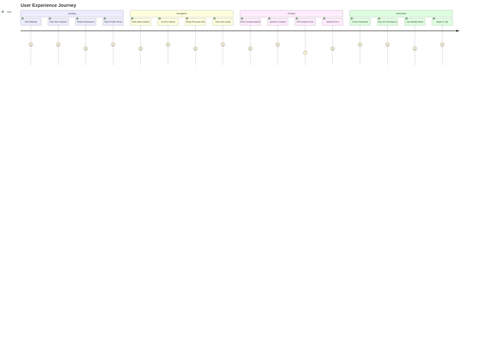
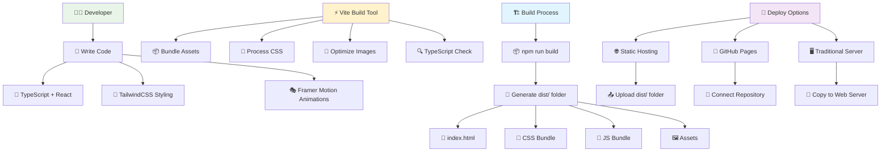

# 🔄 Flowchart Website Portofolio Faizah Azzahra

## 📊 Flowchart Utama - User Journey

```mermaid
graph TD
    A[👤 User Access Website] --> B[🌐 Load index.html]
    B --> C[⚡ Vite Dev Server]
    C --> D[📱 Load App.tsx]
    
    D --> E[🧭 Initialize Navbar]
    D --> F[🏠 Initialize Hero Section]
    D --> G[👤 Initialize About Section]
    D --> H[📞 Initialize Contact Section]
    D --> I[🦶 Initialize Footer]
    
    E --> E1[📱 Check Mobile/Desktop]
    E1 --> E2[🍔 Render Mobile Menu]
    E1 --> E3[🖥️ Render Desktop Menu]
    
    F --> F1[🖼️ Load Profile Image]
    F --> F2[📝 Render Title with 3D Animation]
    F --> F3[🎯 Render CTA Buttons]
    
    G --> G1[🖼️ Load About Image with 3D Entrance]
    G --> G2[📋 Render Personal Info Cards]
    G --> G3[📖 Render Description Text]
    
    H --> H1[📝 Initialize Contact Form]
    H --> H2[📇 Render Contact Info Cards]
    H --> H3[🔗 Render Social Media Links]
    
    I --> I1[⬆️ Render Back to Top Button]
    I --> I2[💖 Render Heart Animation]
    I --> I3[📄 Render Copyright Info]
    
    J[👆 User Interaction] --> K{🔍 Interaction Type}
    
    K -->|🖱️ Click Navigation| L[🧭 Smooth Scroll to Section]
    K -->|📱 Mobile Menu| M[🍔 Toggle Mobile Menu]
    K -->|📝 Form Submit| N[📧 Handle Form Submission]
    K -->|⬆️ Back to Top| O[📜 Scroll to Top]
    K -->|🎯 Hover Effects| P[✨ Trigger 3D Animations]
    
    L --> Q[📍 Navigate to Target Section]
    M --> R[📱 Show/Hide Mobile Menu]
    N --> S[✅ Form Validation & Submit]
    O --> T[🏠 Scroll to Hero Section]
    P --> U[🎭 Apply 3D Transform Effects]
    
    Q --> V[👁️ Section in View]
    V --> W[🎬 Trigger Scroll Animations]
    
    style A fill:#e1f5fe
    style D fill:#f3e5f5
    style J fill:#fff3e0
    style K fill:#fce4ec
```

## 🎭 Flowchart Animasi & Interaksi

```mermaid
graph TD
    A[🎬 Animation Trigger] --> B{🔍 Trigger Type}
    
    B -->|📱 Page Load| C[🏠 Initial Page Animations]
    B -->|👁️ Scroll into View| D[📜 Scroll-triggered Animations]
    B -->|🖱️ Hover| E[🎯 Hover Animations]
    B -->|👆 Click| F[⚡ Click Animations]
    
    C --> C1[🧭 Navbar Slide Down]
    C --> C2[🖼️ Hero Image Scale In]
    C --> C3[📝 Title Fade + RotateX]
    C --> C4[🎯 Buttons Stagger In]
    
    D --> D1[👤 About Image RotateY + Scale]
    D --> D2[📋 Cards RotateX + Fade]
    D --> D3[📞 Contact Cards RotateX + Slide]
    
    E --> E1[🏠 Hero Title: RotateY + Scale]
    E --> E2[🎯 Buttons: RotateY ±5° + Shadow]
    E --> E3[👤 About Image: RotateY + Scale]
    E --> E4[📋 Info Cards: RotateY + Lift]
    E --> E5[📞 Contact Cards: RotateY + Slide]
    E --> E6[🧭 Logo: RotateY + Shadow]
    
    F --> F1[🎯 Button Press: Scale Down]
    F --> F2[🍔 Menu Toggle: Scale + Rotate]
    F --> F3[⬆️ Back to Top: Scale + Bounce]
    
    G[⚙️ Animation Engine] --> H[🎭 Framer Motion]
    H --> I[📐 Transform Properties]
    I --> J[🔄 Transition Config]
    J --> K[⏱️ Duration & Easing]
    
    L[🎨 3D Effects] --> M[📐 rotateX, rotateY, rotateZ]
    L --> N[📏 scale, translateX, translateY]
    L --> O[🎭 opacity, boxShadow]
    L --> P[🎪 transformStyle: preserve-3d]
    
    style A fill:#e8f5e8
    style B fill:#fff2cc
    style G fill:#e1f5fe
    style L fill:#f3e5f5
```

## 📱 Flowchart Responsive Design

```mermaid
graph TD
    A[📱 Device Detection] --> B{🔍 Screen Size}
    
    B -->|📱 < 640px| C[📱 Mobile Layout]
    B -->|💻 640px - 1024px| D[💻 Tablet Layout]
    B -->|🖥️ > 1024px| E[🖥️ Desktop Layout]
    
    C --> C1[🍔 Hamburger Menu]
    C --> C2[📱 Single Column Layout]
    C --> C3[👆 Touch-friendly Buttons]
    C --> C4[🖼️ Optimized Images]
    C --> C5[🎭 Reduced Animations]
    
    D --> D1[🖥️ Desktop Menu]
    D --> D2[📊 2-Column Grid]
    D --> D3[🖱️ Hover Effects]
    D --> D4[🖼️ Medium Images]
    D --> D5[🎭 Medium Animations]
    
    E --> E1[🖥️ Full Desktop Menu]
    E --> E2[📊 Multi-Column Grid]
    E --> E3[🎯 Full Hover Effects]
    E --> E4[🖼️ High-res Images]
    E --> E5[🎭 Full 3D Animations]
    
    F[🎨 Styling System] --> G[🎨 TailwindCSS]
    G --> H[📱 Responsive Classes]
    H --> I[sm:, md:, lg:, xl:, 2xl:]
    
    J[🔄 Layout Changes] --> K[📱 Mobile: Stack Vertically]
    J --> L[💻 Tablet: 2-Column Grid]
    J --> M[🖥️ Desktop: Multi-Column]
    
    N[🎭 Animation Adaptations] --> O[📱 Mobile: Simple Scale]
    N --> P[💻 Tablet: Basic 3D]
    N --> Q[🖥️ Desktop: Full 3D Effects]
    
    style A fill:#e8f5e8
    style B fill:#fff2cc
    style F fill:#e1f5fe
    style J fill:#f3e5f5
```

## 🏗️ Flowchart Komponen Architecture

```mermaid
graph TD
    A[📱 App.tsx] --> B[🧭 Navbar.tsx]
    A --> C[🏠 Hero.tsx]
    A --> D[👤 About.tsx]
    A --> E[📞 Contact.tsx]
    A --> F[🦶 Footer.tsx]
    
    B --> B1[📱 Mobile Menu State]
    B --> B2[🖥️ Desktop Navigation]
    B --> B3[🎭 Logo 3D Animation]
    B --> B4[📜 Scroll Background]
    
    C --> C1[🖼️ Profile Image Component]
    C --> C2[📝 Animated Title]
    C --> C3[🎯 CTA Buttons]
    C --> C4[⬇️ Scroll Indicator]
    
    D --> D1[🖼️ About Image with 3D]
    D --> D2[📋 Personal Info Cards]
    D --> D3[📖 Content Description]
    D --> D4[👁️ Scroll-triggered Animations]
    
    E --> E1[📝 Contact Form]
    E --> E2[📇 Contact Info Cards]
    E --> E3[🔗 Social Media Links]
    E --> E4[💖 Thank You Message]
    
    F --> F1[⬆️ Back to Top Button]
    F --> F2[🔗 Quick Navigation]
    F --> F3[💖 Heart Animation]
    F --> F4[📄 Copyright Info]
    
    G[🎭 Shared Components] --> H[🎨 Motion Wrapper]
    G --> I[🎯 Button Components]
    G --> J[📋 Card Components]
    G --> K[🖼️ Image Components]
    
    L[⚙️ Hooks & Utils] --> M[👁️ useInView Hook]
    L --> N[📱 useMobile Hook]
    L --> O[🎭 Animation Utils]
    L --> P[📧 Form Utils]
    
    style A fill:#e8f5e8
    style G fill:#fff2cc
    style L fill:#e1f5fe
```

## 🎯 Flowchart User Experience Flow

## 🔧 Flowchart Development & Build Process

## 🎨 Flowchart Design System

```mermaid
graph TD
    A[🎨 Design System] --> B[🎨 Color Palette]
    A --> C[📝 Typography]
    A --> D[📏 Spacing]
    A --> E[🎭 Animations]
    
    B --> B1[🔵 Navy: #1e3a8a]
    B --> B2[⚪ White: #ffffff]
    B --> B3[🔘 Gray: #f8fafc]
    B --> B4[📝 Text: #1f2937]
    
    C --> C1[📝 Poppins: Headings]
    C --> C2[📝 Inter: Body Text]
    C --> C3[📝 Lato: Subtitles]
    
    D --> D1[📏 Section: 4rem]
    D --> D2[📏 Component: 1.5rem]
    D --> D3[📏 Card: 1.5rem]
    D --> D4[📏 Button: 0.75rem 1.5rem]
    
    E --> E1[⏱️ Duration: 0.3s hover, 0.8s entrance]
    E --> E2[🎪 Easing: ease-out]
    E --> E3[📐 3D: rotateX, rotateY, scale]
    E --> E4[🎭 Stagger: 0.1s delay]
    
    F[🎨 TailwindCSS Classes] --> G[🎨 Utility Classes]
    F --> H[🎨 Custom Components]
    F --> I[🎨 Responsive Classes]
    
    G --> G1[🎨 btn-primary]
    G --> G2[🎨 btn-secondary]
    G --> G3[🎨 section-padding]
    G --> G4[🎨 container-max]
    
    style A fill:#e8f5e8
    style F fill:#fff2cc
```

## 📊 Flowchart Performance Optimization

```mermaid
graph TD
    A[⚡ Performance Optimization] --> B[📦 Bundle Optimization]
    A --> C[🖼️ Image Optimization]
    A --> D[🎭 Animation Optimization]
    A --> E[📱 Mobile Optimization]
    
    B --> B1[🌳 Tree Shaking]
    B --> B2[📦 Code Splitting]
    B --> B3[🗜️ Minification]
    B --> B4[🎨 CSS Purging]
    
    C --> C1[📐 Responsive Images]
    C --> C2[⚡ Lazy Loading]
    C --> C3[🗜️ Image Compression]
    C --> C4[📱 WebP Format]
    
    D --> D1[🎭 Reduced Mobile Animations]
    D --> D2[⚡ GPU Acceleration]
    D --> D3[🎪 Optimized Transitions]
    D --> D4[📐 transform3d Usage]
    
    E --> E1[📱 Touch-friendly Sizes]
    E --> E2[⚡ Reduced JavaScript]
    E --> E3[🎨 Optimized CSS]
    E --> E4[📱 Mobile-first Approach]
    
    F[📊 Performance Metrics] --> G[⚡ Lighthouse Scores]
    G --> G1[🎯 Performance: 90+]
    G --> G2[♿ Accessibility: 95+]
    G --> G3[✅ Best Practices: 95+]
    G --> G4[🔍 SEO: 90+]
    
    style A fill:#e8f5e8
    style F fill:#fff2cc
```

---

## 📋 Penjelasan Flowchart

### 🎯 **Flowchart Utama - User Journey**
Menunjukkan alur lengkap dari user mengakses website hingga berinteraksi dengan semua fitur, termasuk rendering komponen dan handling user interactions.

### 🎭 **Flowchart Animasi & Interaksi**
Detail tentang bagaimana animasi dipicu dan dijalankan, termasuk semua efek 3D dan transisi yang ada di website.

### 📱 **Flowchart Responsive Design**
Menjelaskan bagaimana website beradaptasi dengan berbagai ukuran layar dan device, termasuk perubahan layout dan animasi.

### 🏗️ **Flowchart Komponen Architecture**
Struktur komponen React dan bagaimana mereka berinteraksi, termasuk shared components dan hooks yang digunakan.

### 🎯 **User Experience Journey**
Menggunakan Mermaid journey untuk menunjukkan pengalaman user dari awal hingga akhir dengan rating kepuasan.

### 🔧 **Flowchart Development & Build Process**
Alur development, build process, dan deployment options yang tersedia.

### 🎨 **Flowchart Design System**
Sistem desain yang digunakan termasuk color palette, typography, spacing, dan animasi.

### 📊 **Flowchart Performance Optimization**
Strategi optimasi performa untuk memastikan website berjalan dengan cepat dan efisien.

Semua flowchart ini memberikan panduan visual yang komprehensif untuk memahami bagaimana website portofolio bekerja dari berbagai aspek.
