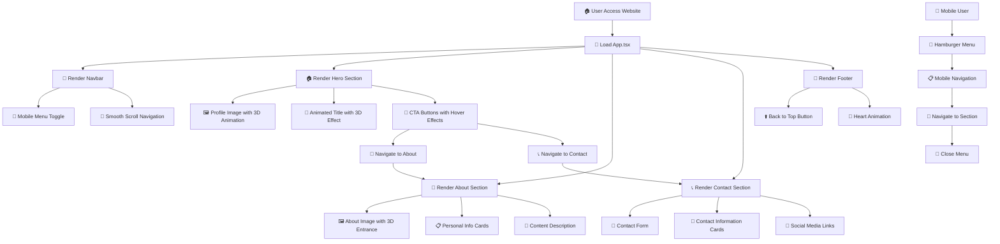

# 📄 Faizah Azzahra - Personal Portfolio

[](https://reactjs.org/)
[](https://www.typescriptlang.org/)
[](https://tailwindcss.com/)
[](https://vitejs.dev/)
[](https://www.framer.com/motion/)

Website portofolio pribadi formal dengan desain profesional dan modern menggunakan React + TypeScript dan TailwindCSS. Website ini dirancang sebagai representasi diri yang elegan, tenang, dan kredibel.

## 📋 Daftar Isi

- [🚀 Fitur Utama](#-fitur-utama)
- [📁 Struktur Proyek](#-struktur-proyek)
- [🎨 Komponen & Halaman](#-komponen--halaman)
- [🔄 Flowchart Aplikasi](#-flowchart-aplikasi)
- [🛠️ Teknologi](#️-teknologi)
- [📦 Instalasi & Setup](#-instalasi--setup)
- [🏗️ Build & Deploy](#️-build--deploy)
- [🎯 Filosofi Desain](#-filosofi-desain)
- [✨ Animasi & Interaksi](#-animasi--interaksi)
- [📱 Responsive Design](#-responsive-design)
- [🔧 Customization](#-customization)
- [📊 Performance](#-performance)
- [🐛 Troubleshooting](#-troubleshooting)
- [📄 Lisensi](#-lisensi)

## 🚀 Fitur Utama

### ✨ **Design & User Experience**
- **Tema Profesional**: Warna putih, abu-abu lembut, dan aksen navy
- **Typography Elegan**: Font Inter, Lato, dan Poppins
- **Layout Clean**: Desain minimalis yang fokus pada konten
- **Responsive**: Optimal di desktop, tablet, dan mobile

### 🎭 **Animasi & Interaksi**
- **3D Effects**: Rotasi dan transformasi 3D yang subtle
- **Framer Motion**: Animasi halus dan transisi yang elegan
- **Hover Effects**: Interaksi yang responsif dan menarik
- **Scroll Animations**: Animasi yang muncul saat scroll

### 🏗️ **Teknologi & Performance**
- **TypeScript**: Type safety dan developer experience
- **Vite**: Build tool yang cepat dan efisien
- **TailwindCSS**: Utility-first CSS framework
- **Component Architecture**: Struktur yang modular dan maintainable

## 📁 Struktur Proyek

```
faizah-portfolio/
├── 📁 public/
│   └── vite.svg
├── 📁 src/
│   ├── 📁 components/
│   │   ├── 📄 Navbar.tsx          # Navigasi utama dengan hamburger menu
│   │   ├── 📄 Hero.tsx            # Section utama dengan foto profil
│   │   ├── 📄 About.tsx           # Tentang saya dengan info pribadi
│   │   ├── 📄 Contact.tsx         # Form kontak dan informasi
│   │   └── 📄 Footer.tsx          # Footer dengan navigasi cepat
│   ├── 📄 App.tsx                 # Komponen utama aplikasi
│   ├── 📄 main.tsx               # Entry point aplikasi
│   └── 📄 index.css              # Global styles dan Tailwind imports
├── 📄 index.html                 # HTML template
├── 📄 package.json               # Dependencies dan scripts
├── 📄 tailwind.config.js         # Konfigurasi TailwindCSS
├── 📄 postcss.config.js          # Konfigurasi PostCSS
├── 📄 tsconfig.json              # Konfigurasi TypeScript
├── 📄 tsconfig.node.json         # Konfigurasi TypeScript untuk Node
├── 📄 vite.config.ts             # Konfigurasi Vite
├── 📄 .gitignore                 # Git ignore rules
└── 📄 README.md                  # Dokumentasi proyek
```

## 🎨 Komponen & Halaman

### 🏠 **Hero Section** (`Hero.tsx`)
```typescript
// Fitur utama:
- Foto profil dengan border animasi
- Judul nama dengan efek 3D
- Deskripsi singkat
- Tombol CTA dengan hover effects
- Scroll indicator animasi
```

**Animasi 3D:**
- `rotateX: -15` → `rotateX: 0` (initial)
- `rotateY: 2` pada hover (judul)
- `rotateY: ±5` pada tombol hover

### 👤 **About Section** (`About.tsx`)
```typescript
// Fitur utama:
- Foto dengan efek 3D masuk
- Deskripsi pribadi lengkap
- 4 kartu informasi (Hobi, Kepribadian, Filosofi, Keseharian)
- Animasi scroll-triggered
```

**Animasi 3D:**
- `rotateY: -20` → `rotateY: 0` (foto)
- `rotateX: -10` → `rotateX: 0` (kartu)
- `rotateY: 3` pada hover (kartu)

### 📞 **Contact Section** (`Contact.tsx`)
```typescript
// Fitur utama:
- Form kontak dengan validasi
- Informasi kontak (Email, Phone, Lokasi)
- Social media links
- Pesan terima kasih
```

**Animasi 3D:**
- `rotateX: -10` → `rotateX: 0` (kartu kontak)
- `rotateY: 2` pada tombol submit
- `rotateY: 3` pada hover kartu

### 🧭 **Navigation** (`Navbar.tsx`)
```typescript
// Fitur utama:
- Logo dengan efek 3D
- Menu desktop dan mobile
- Scroll-based background change
- Smooth scroll navigation
```

**Animasi 3D:**
- `rotateY: 10` pada logo hover

### 🦶 **Footer** (`Footer.tsx`)
```typescript
// Fitur utama:
- Informasi copyright
- Navigasi cepat
- Tombol back to top
- Heart animation
```

## 🔄 Flowchart Aplikasi



## 🛠️ Teknologi

### **Frontend Framework**
- **React 18.2.0** - Library UI dengan hooks dan modern features
- **TypeScript 5.2.2** - Type safety dan developer experience

### **Build Tools**
- **Vite 5.0.8** - Fast build tool dan dev server
- **PostCSS** - CSS processing
- **ESLint** - Code linting

### **Styling & Animation**
- **TailwindCSS 3.3.6** - Utility-first CSS framework
- **Framer Motion 10.16.16** - Animation library
- **Lucide React 0.294.0** - Icon library

### **Development Dependencies**
```json
{
  "@types/react": "^18.2.43",
  "@types/react-dom": "^18.2.17",
  "@vitejs/plugin-react": "^4.2.1",
  "autoprefixer": "^10.4.16",
  "eslint": "^8.55.0"
}
```

## 📦 Instalasi & Setup

### **Prerequisites**
- Node.js (versi 16 atau lebih baru)
- npm atau yarn package manager

### **1. Clone atau Download Project**
```bash
# Jika menggunakan git
git clone <repository-url>
cd faizah-portfolio

# Atau download dan extract ZIP file
```

### **2. Install Dependencies**
```bash
npm install
# atau
yarn install
```

### **3. Jalankan Development Server**
```bash
npm run dev
# atau
yarn dev
```

### **4. Akses Website**
Buka browser dan akses: `http://localhost:5173`

### **5. Build untuk Production**
```bash
npm run build
# atau
yarn build
```

### **6. Preview Production Build**
```bash
npm run preview
# atau
yarn preview
```

## 🏗️ Build & Deploy

### **Build Process**
```bash
# Build production
npm run build

# Output akan tersimpan di folder 'dist/'
# Berisi:
# - index.html
# - assets/ (CSS, JS, images)
```

### **Deploy Options**

#### **1. Static Hosting (Netlify, Vercel)**
```bash
# Upload folder 'dist/' ke hosting provider
# Atau connect repository untuk auto-deploy
```

#### **2. GitHub Pages**
```bash
# Install gh-pages
npm install --save-dev gh-pages

# Add script di package.json
"homepage": "https://username.github.io/faizah-portfolio",
"scripts": {
  "predeploy": "npm run build",
  "deploy": "gh-pages -d dist"
}

# Deploy
npm run deploy
```

#### **3. Traditional Web Server**
```bash
# Copy isi folder 'dist/' ke web server
# Pastikan server support SPA routing
```

## 🎯 Filosofi Desain

### **🎨 Visual Design Principles**

#### **Color Palette**
```css
Primary Navy: #1e3a8a (navy-800)
Secondary Gray: #f8fafc (gray-50)
Accent White: #ffffff
Text Dark: #1f2937 (gray-800)
Text Light: #6b7280 (gray-500)
```

#### **Typography Scale**
```css
Heading 1: 3rem (48px) - Poppins Bold
Heading 2: 2.25rem (36px) - Poppins SemiBold
Body Large: 1.125rem (18px) - Inter Regular
Body: 1rem (16px) - Inter Regular
Small: 0.875rem (14px) - Inter Regular
```

#### **Spacing System**
```css
Section Padding: 4rem (64px)
Component Gap: 1.5rem (24px)
Card Padding: 1.5rem (24px)
Button Padding: 0.75rem 1.5rem
```

### **🧠 UX Principles**

1. **Minimalism**: Fokus pada konten penting
2. **Accessibility**: Kontras warna yang baik, navigasi keyboard
3. **Performance**: Optimized images, lazy loading
4. **Responsiveness**: Mobile-first approach
5. **Consistency**: Design system yang konsisten

## ✨ Animasi & Interaksi

### **🎭 3D Animation Effects**

#### **Hero Section**
```typescript
// Title Animation
initial: { rotateX: -15, opacity: 0, y: 30 }
animate: { rotateX: 0, opacity: 1, y: 0 }
hover: { rotateY: 2, scale: 1.02 }

// Button Animation
hover: { 
  rotateY: ±5, 
  scale: 1.05,
  boxShadow: "0 10px 25px rgba(30, 58, 138, 0.3)"
}
```

#### **About Section**
```typescript
// Image Animation
initial: { rotateY: -20, scale: 0.8, opacity: 0 }
animate: { rotateY: 0, scale: 1, opacity: 1 }
hover: { rotateY: 2, scale: 1.02 }

// Card Animation
initial: { rotateX: -10, opacity: 0, y: 30 }
animate: { rotateX: 0, opacity: 1, y: 0 }
hover: { rotateY: 3, scale: 1.05, y: -5 }
```

#### **Contact Section**
```typescript
// Contact Card Animation
initial: { rotateX: -10, opacity: 0, y: 20 }
animate: { rotateX: 0, opacity: 1, y: 0 }
hover: { rotateY: 3, scale: 1.02, x: 10 }

// Submit Button Animation
hover: { 
  rotateY: 2, 
  scale: 1.02,
  boxShadow: "0 10px 25px rgba(30, 58, 138, 0.3)"
}
```

### **🎪 Transition Effects**
- **Duration**: 0.3s untuk hover, 0.8s untuk entrance
- **Easing**: ease-out untuk smooth feeling
- **Stagger**: 0.1s delay antar elemen
- **3D Transform**: `transformStyle: 'preserve-3d'`

## 📱 Responsive Design

### **Breakpoints**
```css
Mobile: < 640px (sm)
Tablet: 640px - 1024px (md, lg)
Desktop: > 1024px (xl, 2xl)
```

### **Mobile Optimizations**
- Hamburger menu untuk navigasi
- Stacked layout untuk form
- Touch-friendly button sizes
- Optimized image sizes
- Reduced animation complexity

### **Tablet Adaptations**
- 2-column layout untuk cards
- Adjusted spacing
- Medium font sizes

### **Desktop Enhancements**
- Full 3D animations
- Multi-column layouts
- Hover effects
- Larger typography

## 🔧 Customization

### **🎨 Mengubah Warna Tema**
Edit file `tailwind.config.js`:
```javascript
theme: {
  extend: {
    colors: {
      'navy': {
        // Sesuaikan warna navy
        800: '#1e3a8a', // Primary
        700: '#1e40af', // Darker
        600: '#2563eb', // Lighter
      }
    }
  }
}
```

### **📝 Mengubah Konten**
1. **Hero Section** (`Hero.tsx`):
   ```typescript
   // Ganti nama dan deskripsi
   <h1>Nama Anda</h1>
   <p>Deskripsi Anda</p>
   ```

2. **About Section** (`About.tsx`):
   ```typescript
   // Update personal info
   const personalInfo = [
     {
       icon: BookOpen,
       title: "Hobi Anda",
       description: "Deskripsi hobi..."
     }
   ];
   ```

3. **Contact Section** (`Contact.tsx`):
   ```typescript
   // Update contact information
   const contactInfo = [
     {
       icon: Mail,
       title: "Email",
       value: "email@anda.com",
       link: "mailto:email@anda.com"
     }
   ];
   ```

### **🖼️ Mengganti Foto**
1. **Upload foto** ke folder `public/` atau hosting online
2. **Update URL** di komponen:
   ```typescript
   // Hero.tsx dan About.tsx
   src="path/to/your/photo.jpg"
   ```

### **🔗 Mengupdate Social Links**
Edit di `Contact.tsx`:
```typescript
const socialLinks = [
  {
    icon: Linkedin,
    name: "LinkedIn",
    url: "https://linkedin.com/in/username",
    color: "hover:text-blue-600"
  }
];
```

## 📊 Performance

### **Optimization Features**
- **Code Splitting**: Automatic dengan Vite
- **Tree Shaking**: Unused code removal
- **Image Optimization**: Responsive images
- **CSS Purging**: TailwindCSS removes unused styles
- **Bundle Analysis**: Built-in Vite analyzer

### **Performance Metrics**
```bash
# Analyze bundle size
npm run build
npx vite-bundle-analyzer dist

# Lighthouse scores target:
# Performance: 90+
# Accessibility: 95+
# Best Practices: 95+
# SEO: 90+
```

### **Loading Optimization**
- Lazy loading untuk images
- Preload critical resources
- Minimal JavaScript bundle
- Optimized CSS delivery

## 🐛 Troubleshooting

### **Common Issues**

#### **1. Dependencies Installation Error**
```bash
# Clear cache dan reinstall
rm -rf node_modules package-lock.json
npm install
```

#### **2. TypeScript Errors**
```bash
# Check TypeScript version compatibility
npm install @types/react@latest @types/react-dom@latest
```

#### **3. TailwindCSS Not Working**
```bash
# Verify PostCSS configuration
npm install tailwindcss postcss autoprefixer
npx tailwindcss init -p
```

#### **4. Build Errors**
```bash
# Check for TypeScript errors
npm run build
# Fix any type errors before building
```

#### **5. Animation Performance Issues**
```typescript
// Reduce animation complexity on mobile
const isMobile = window.innerWidth < 768;
const animationProps = isMobile 
  ? { scale: 1.05 } 
  : { scale: 1.05, rotateY: 5 };
```

### **Debug Mode**
```typescript
// Enable Framer Motion debug
<motion.div
  animate={{ x: 100 }}
  transition={{ duration: 2 }}
  style={{ background: "red" }} // Visual debug
>
```

## 📄 Lisensi

```
© 2025 Faizah Azzahra. All Rights Reserved.

Website portofolio pribadi ini dibuat dengan tujuan personal branding 
dan representasi diri yang profesional. Semua konten, desain, dan 
kode dalam proyek ini adalah milik pribadi Faizah Azzahra.

Dilarang mengcopy, memodifikasi, atau menggunakan ulang tanpa 
izin tertulis dari pemilik.
```

---

## 📞 Kontak & Support

**Dibuat dengan ❤️ oleh Faizah Azzahra**

Jika ada pertanyaan atau feedback mengenai website ini, 
silahkan hubungi melalui:

- 📧 Email: faizah.azzahra@example.com
- 💼 LinkedIn: [Faizah Azzahra](https://linkedin.com/in/faizah-azzahra)
- 📱 Instagram: [@faizah.azzahra](https://instagram.com/faizah.azzahra)

---

*Terima kasih telah mengunjungi portofolio pribadi saya!* 🙏
